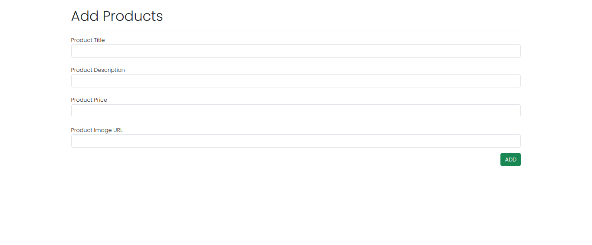
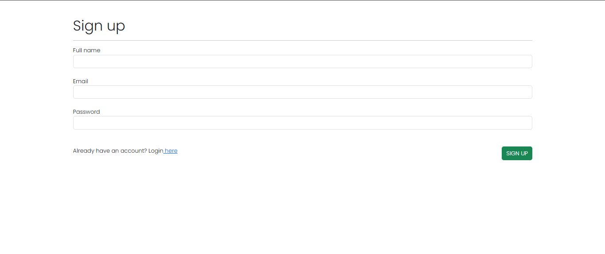
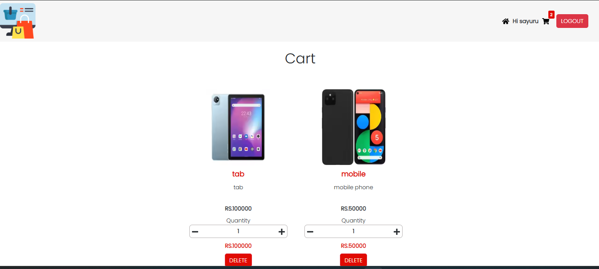

# E-Commerce Platform 🛒

This **E-Commerce Platform** is a fully responsive web application built using **React** and **Firebase**. It features an **admin panel** for managing products, along with **advanced filters**, **secure checkout**, and **cart functionality**. Users can browse products, apply filters, and complete transactions, while admins can update the product catalog.

---

## ✨ Features

- 🛍️ **Product Management**: Add, update, and manage product details.
- 🔍 **Advanced Filters**: Filter products based on categories, price, and more.
- 🛒 **Cart & Checkout**: Secure checkout and order management.
- 🔐 **User Authentication**: Firebase email authentication for secure login.
- 🔥 **Firestore Database**: Store and retrieve product and user data efficiently.
- 📱 **Responsive Design**: Works across all devices for a seamless experience.

---

## 🛠️ Technologies Used

- **Frontend**: React.js
- **Authentication**: Firebase Authentication
- **Database**: Firestore Database

---

## 📂 Project Details

- **Introductory Video**: [Watch Here](https://drive.google.com/file/d/1nB_WzaGIjw-87NDlcDbx9aNlvmVGM6km/view?usp=drive_link)

---

## 📱 Screenshots



---

## 🚀 Installation

1. Clone the repository:
   ```bash
   git clone https://github.com/your-repo.git
   cd your-repo
   ```
2. Install dependencies:
   ```bash
   npm install
   ```
3. Create a `.env` file in the root directory and add your Firebase configuration:
   ```env
   REACT_APP_FIREBASE_API_KEY=your_api_key
   REACT_APP_FIREBASE_AUTH_DOMAIN=your_auth_domain
   REACT_APP_FIREBASE_PROJECT_ID=your_project_id
   REACT_APP_FIREBASE_STORAGE_BUCKET=your_storage_bucket
   REACT_APP_FIREBASE_MESSAGING_SENDER_ID=your_messaging_sender_id
   REACT_APP_FIREBASE_APP_ID=your_app_id
   ```
4. Start the development server:
   ```bash
   npm start
   ```

---

## 🌍 Deployment

To deploy your project, you can use Firebase Hosting, Vercel, or Netlify.

For Firebase Hosting:
```bash
npm run build
firebase deploy
```

---

## 👨‍💻 Author
Vihagana99  
[GitHub Profile](https://github.com/vihagana99)
